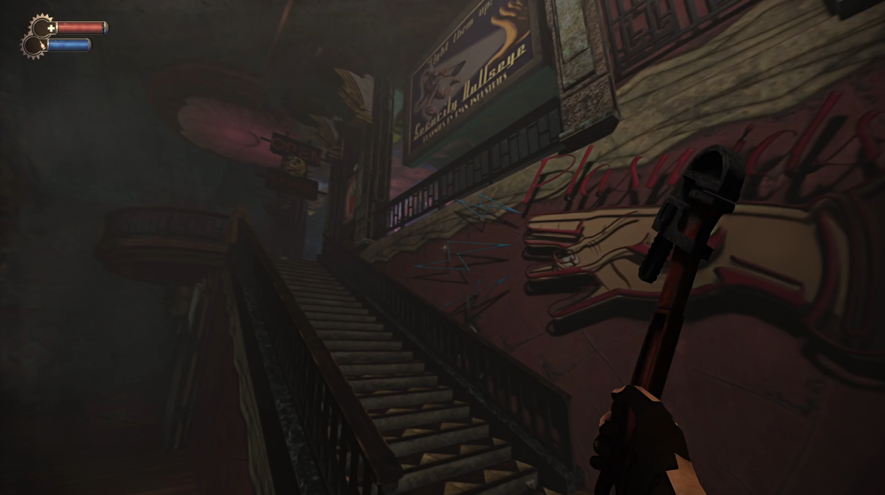

<h1 align="center">Collection of Random RTX Remix Compatibility Mods</h1>

 

 

Game modifications specifically made for nvidia's [rtx-remix](https://github.com/NVIDIAGameWorks/rtx-remix).  
How does a shader based game work with remix? By manually reimplementing fixed function rendering :) 

 

 

If you want to support my work, consider buying me some coffee: &ensp;&ensp;

 

## Mods:
#### Bioshock 1 (GOG)  
###### The good:  
- Pretty stable
- Most things rendered via fixed function
- Reduced culling

###### The bad:
- _"Broken"_ vertex normals (Normals are packed and that is currently not supported by remix)
- Some stuff appears emissive and might flicker from time to time
- Hash of (og.) emissive textures changes

 

#### Fear 1 Platinum (GOG)  
###### The good:  
- Somewhat stable
- Most things rendered via fixed function
- GPU Skinned meshes via fixed function
- ImGui menu (F4)
- Reduced frustum culling

###### The bad:
- Hash of a lot of "models" not stable
- Currently can not get remix "friendly" anti-culling to work so it's either light leaking and unstable hashes or rendering the entire map (which is possible via the ImGui menu)
- original skybox is broken (currently rendering a unique marker with a skysphere attached to it via remix replacements)

 

#### Mirrors Edge (GOG)  
###### The good:  
- Boots, ImGui menu
- Fake camera to enable pathtracing

###### The bad:
- Utterly broken, texcoords (UV's) are half floats and normals are packed
- No game camera data or mesh transforms yet
- Currently not worth proceeding 

 

#### Anno 1404 Gold Edition (GOG)  
###### The good:  
- Boots, ImGui menu
- Game camera transforms to enable path tracing (ImGui F5 -> enable fake cam (temporary name))
- Fixed function rendering of models (incl. dynamic models)

###### The bad:
- still very broken and very WIP

 

## Overall usage
- Press `F5` to open the in-game gui for some compatibility tweaks or debug settings
  - Using the fake camera will most likely enable remix path tracing 

 

## Compiling
- Clone the repository `git clone --recurse-submodules <URL>`
- Run `generate-buildfiles_vs22.bat` to generate VS project files
- Compile the mod of your choice
- Copy the mod dll into your game directory along with the files in the `assets/<Mod>` folder
  - check if `assets/<Mod>` contains `_not_root_folder` and place the files in there accordingly

 

#### ⚠️ Note

- Heavy wip
- Most of the mods don't work very well (if at all) 

 

##  Credits
- [Nvidia - RTX Remix](https://github.com/NVIDIAGameWorks/rtx-remix)
- [People of the showcase discord](https://discord.gg/j6sh7JD3v9) - especially the nvidia engineers ✌️
- [dear-imgui](https://github.com/ocornut/imgui)
- [imgui-blur-effect](https://github.com/3r4y/imgui-blur-effect)
- [minhook](https://github.com/TsudaKageyu/minhook)
- [toml11](https://github.com/ToruNiina/toml11)
- [dxwrapper](https://github.com/elishacloud/dxwrapper)

 

