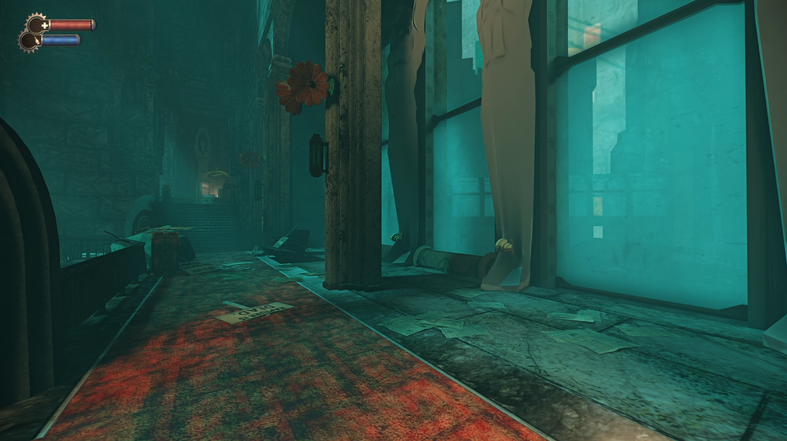
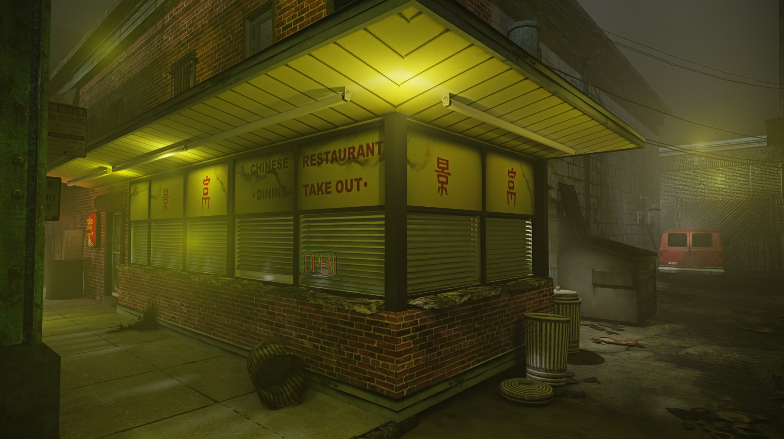
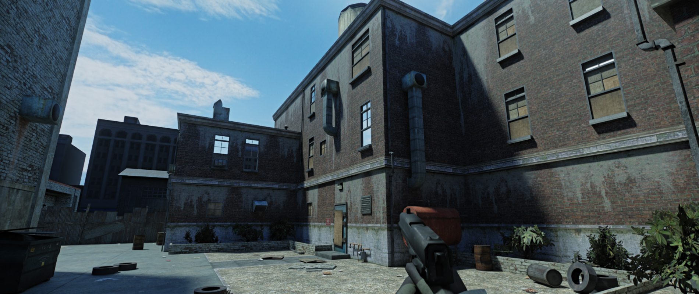
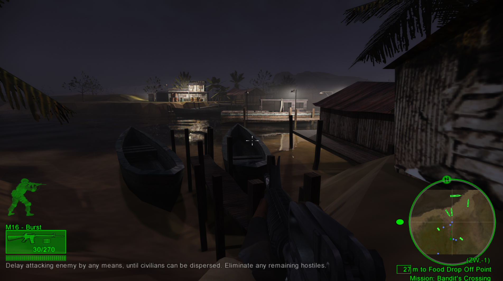
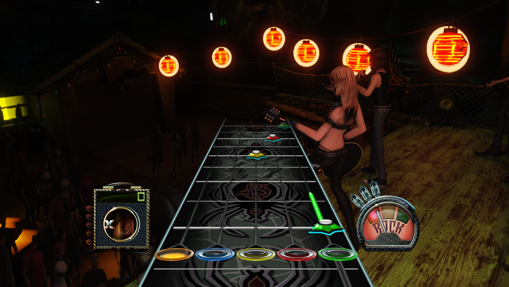
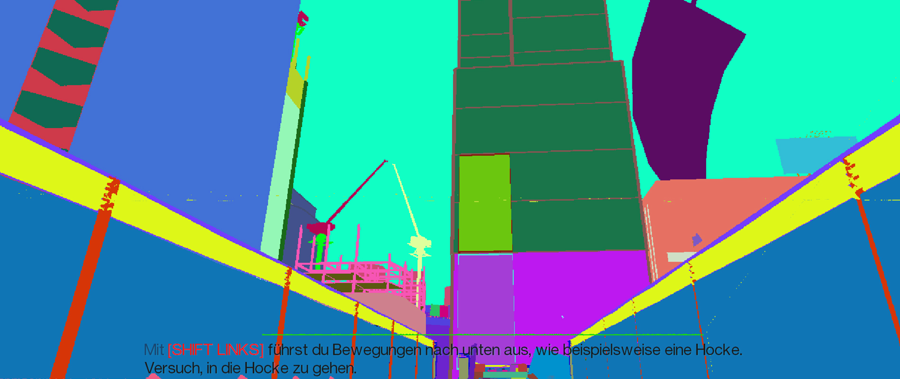
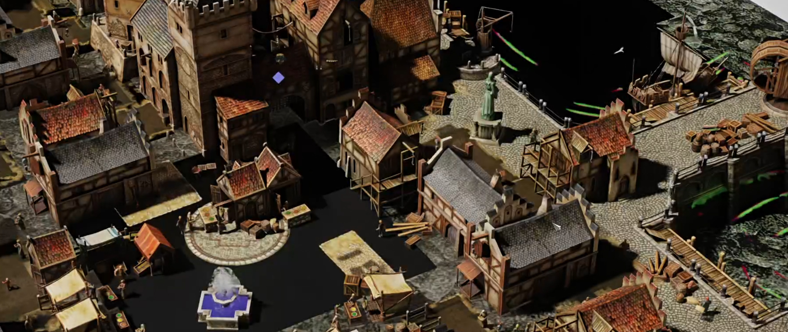

<h1 align="center">Collection of Random RTX Remix Compatibility Mods</h1>

 

 

Game modifications specifically made for nvidia's [rtx-remix](https://github.com/NVIDIAGameWorks/rtx-remix).  
How does a shader based game work with remix? By manually reimplementing fixed function rendering :) 

 

If you want to support my work, consider buying me some coffee: &ensp;&ensp;

 

 

### Table of Contents
__[Bioshock 1 (GOG)](#bioshock-1-gog)__  
__[SWAT 4 Gold (GOG)](#swat-4---gold-gog)__  
__[Fear 1 Platinum (GOG)](#fear-1-platinum-gog)__  
__[Delta Force Black Hawk Down 2003 (GOG)](#delta-force-black-hawk-down-2003)__   
__[Guitar Hero 3 1.31 (HATRED)](#guitar-hero-3)__   
__[Mirrors Edge (GOG)](#mirrors-edge-gog)__ (Broken)  
__[Anno 1404 Gold Edition (GOG)](#anno-1404-gold-edition-gog)__ (Broken)  
__[Manhunt (Steam)](#manhunt-steam)__   
__[ue2fixes](#ue2fixes)__ (UE2 Patcher)  

__[Installing](#installing)__   
__[Overall Usage](#overall-usage)__   
__[Compiling](#compiling)__   

 

_____

 

 

### Bioshock 1 (GOG)  

###### The good:  
- Pretty stable
- Most things rendered via fixed function
- No Frustum Culling
- More Anti-Culling Tweaks (Tweakable via ImGui `F5`)
- Use commandline arg `-disable_normal_hack` to disable vertex normal fixup if you run into weird vertex explosion issues or if this is no longer required due to remix advancements

###### The bad:
- ~~_"Broken"_ vertex normals (Normals are packed and that is currently not supported by remix)~~
- Hash of orig. emissive textures changes

 
 
 

 

### SWAT 4 - Gold (GOG)  

###### The good - game works pretty good out of the box so this mod _only_ features:  
- Disabled frustum culling, backface culling (enabled by default)
- More optional anti culling features
- Forcing of BSP surfaces within a certain distance around the player to help with light leakage
- Commandline arguments:
- `disable_sky` to disable the skybox (required for `anticull1` and fixes remix vram leak)
- `anticull1` to cull even less
- `anticull2` to cull less static actors in normally culled zones
- `backface_culling` to enable backface culling by default (who would want that?)
> All of the above can be tweaked within the ImGui `F4` menu

###### The bad:
- Remix bug: with the sky enabled, unfocusing the game will render only the skybox for a frame and leak a little vram.  
This can also happen randomly when walking through doorways which will ultimativly fill up the entire gpu memory.

 
 
 

 

### Fear 1 Platinum (GOG)  

- Ships with [EchoPatch](https://github.com/Wemino/EchoPatch)

###### The good:  
- Somewhat stable
- Most things rendered via fixed function
- GPU Skinned meshes via fixed function
- ImGui menu (F4)
- Reduced frustum culling

###### The bad:
- Hash of a lot of "models" not stable
- Currently can not get remix "friendly" anti-culling to work so it's either light leaking and unstable hashes or rendering the entire map (which is possible via the ImGui menu)
- original skybox is broken (currently rendering a unique marker with a skysphere attached to it via remix replacements)

 
 
 

 

### Delta Force Black Hawk Down 2003  

- Ships with [DFBHD-Wrapper](https://github.com/SuiMachine/DFBHD-Wrapper/tree/master)

###### The good:  
- Pretty stable out of the box
- Skinned meshes now rendered via fixed function
- Reduced frustum culling
- Fixed game lights breaking the terrain
- Per map configs for remix variables
- Nightvision remix configs
- Commandline Argument: `-disable_terrain` to disable original terrain rendering

###### Usage:
- Change your fov/resolution via `scripts\BHD_Asi.ini` and make sure to use __1280x1024__ in-game

 
 
 

 

### Guitar Hero 3 

###### The good:  
- stable
- most things rendered via fixed function

###### The bad:
- crowd looks a little odd (still rendered via shader - remix issue?)

###### Usage:
- Make sure to read the _README in assets/gh3

 
 
 

 

### Mirrors Edge (GOG)  

###### The good:  
- Boots, ImGui menu
- Fake camera to enable pathtracing

###### The bad:
- Utterly broken, texcoords (UV's) are half floats and normals are packed
- No game camera data or mesh transforms yet
- Currently not worth proceeding 

 
 
 

 

### Anno 1404 Gold Edition (GOG)  

###### The good:  
- Boots, ImGui menu
- Game camera transforms to enable path tracing (ImGui F5 -> enable fake cam (temporary name))
- Fixed function rendering of models (incl. dynamic models)

###### The bad:
- still very broken and very WIP

 
 
 

 

### Manhunt (Steam)  

###### The good:  
- Disabled world / BSP frustum culling
- Disabled the BSP PVS system (no entity culling)
- Launch game with commandline arg `-use_signatures` if the default mode (static offsets) is causing issues

 
 
 

 

### ue2fixes

###### Description and features:
- Tries to fix certain aspects of ue2-2.5 games were no standalone mod is available
- Can currently fix frustum and backface culling on swat4, killingfloor, r6 raven .. other games are untested
- ImGui menu (`F5`) if the game is using d3d9

###### Commandline arguments:
- `disable_sky` to disable the skybox (required for `anticullex` and fixes remix vram leak)
- `anticullex` cull even less
- `nod3d` do not hook the d3d9 interface (imgui wont work), if you are having issues with that
- `async` load signature patches asynchronously - use if the game gets stuck on trying to find the engine.dll

> To install, just grab an asi loader of your choice and drop `a_ue2fixes-rtx.asi` next to your game's exe.  

 
 
 

## Installing
- If there are [Releases](https://github.com/xoxor4d/remix-comp-projects/releases) - grab the latest one and follow the instructions found there
- Installing [Action builds](https://github.com/xoxor4d/remix-comp-projects/actions) requires a GitHub account (to download the artifact)
  - Download the latest [Action build](https://github.com/xoxor4d/remix-comp-projects/actions)
  - Download the latest [remix release](https://github.com/NVIDIAGameWorks/rtx-remix/tags) from github and place the files into your game folder (next to your game executable)
  - Delete the `d3d8to9.dll` that comes with remix
  - Take a look at the `_README` within the game mod folder (eg. `bioshock1`) for further instructions
  - Some game mod folders contain a `_not_root_folder` folder with additional configuration files used by the game. Place accordingly
  - Run the game using the run-with-rtx.bat

 

## Overall usage
- Press `F5` or `F4` to open the in-game gui for some compatibility tweaks or debug settings
  - Using the fake camera will most likely enable remix path tracing

#### ⚠️ Note

- Heavy wip
- Most of the mods don't work very well (if at all) 

 

## Compiling
- Clone the repository `git clone --recurse-submodules <URL>`
- Run `generate-buildfiles_vs22.bat` to generate VS project files
- Compile the mod of your choice
- Copy the mod dll into your game directory along with the files in the `assets/<Mod>` folder
  - check if `assets/<Mod>` contains `_not_root_folder` and place the files in there accordingly

 

##  Credits
- [Nvidia - RTX Remix](https://github.com/NVIDIAGameWorks/rtx-remix)
- [People of the showcase discord](https://discord.gg/j6sh7JD3v9) - especially the nvidia engineers ✌️
- [dear-imgui](https://github.com/ocornut/imgui)
- [imgui-blur-effect](https://github.com/3r4y/imgui-blur-effect)
- [minhook](https://github.com/TsudaKageyu/minhook)
- [toml11](https://github.com/ToruNiina/toml11)
- [dxwrapper](https://github.com/elishacloud/dxwrapper)
- [Ultimate-ASI-Loader](https://github.com/ThirteenAG/Ultimate-ASI-Loader)
- All of the 🍓
